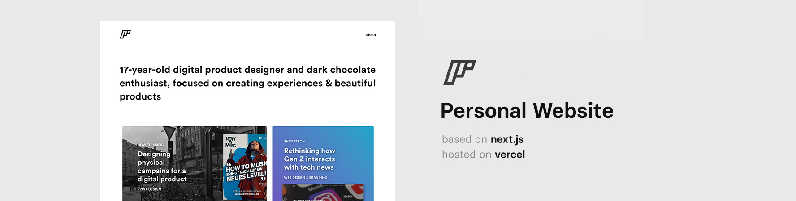

---

  
  

---

Special thanks to Tobias [@tobimori](https://github.com/tobimori) for porting the project over to next.js. Former create-react-app repo can be found here: [personal-website-react](https://github.com/florentinw/personal-website-react)
